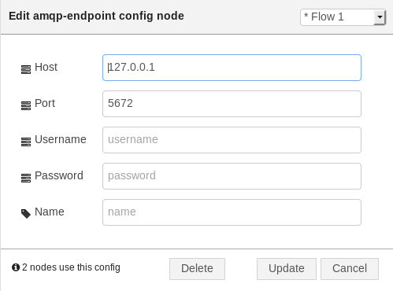

# AMQP Endpoint

This configuration node is needed by all the other AMQP nodes in order to specify the container (endpoint) to connect (i.e. broker, AMQP server, AMQP router, ...).

The informatio to provide are :

* **_Host_** : hostname or IP address of the container to connect;
* **_Port_** : port of the above container;
* **_Name_** : name used to identify the node inside the Node-RED flow;
* **_Username_** : username for using SASL authentication
* **_Password_** : password for using SASL authentication

As defined by the used Rhea library, the default SASL behaviour is as follows. If the username and password are both specified, PLAIN will be used. If only a username is specified, ANONYMOUS will be used. If neither is specified, no SASl layer will be used.

This configuration node defines the AMQP connection and related session that is used to connect to the remote container. All the other provided nodes can use the same endpoint node in order to have their links living in the same connection.
