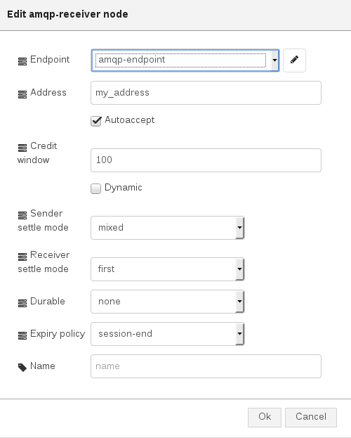

# AMQP Receiver

This is node is useful in order to create an AMQP receiver for connecting to an AMQP container (i.e. broker, AMQP server, AMQP router, ...) and start to receive messages.

## Configuration

The configuration allows to specify following parameters :

* **_Endpoint_** : the AMQP endpoint configuration node which specifies the AMQP container to connect with this receiver;
* **_Address_** : the AMQP address as source for this receiver node;
* **_Autoaccept_** : this flag specifies if received messages should be automatically accepted. Defaults to true;
* **_Credit window_** : A 'credit' window controlling the flow of messages over this receiver. Defaults to 100 if not specified. A value of 0 can be used to turn of automatic flow control and manage it directly;
* **_Dynamic_** : this flag specifies a request for dynamic creation of a remote node (see AMQP 1.0 specification for more information);
* **_Sender settle mode_** : it specifies the sender settle mode with following possibile values _unsettled_, _settled_ and _mixed_ as described by the AMQP 1.0 specification;
* **_Receiver settle mode_** : it specifies the receiver settle mode with following possibile values _first_ and _second_ as described by the AMQP 1.0 specification;
* **_Durable_** : it specifies what state of the terminus will be retained durably: the state of durable messages (_unsettled_state_ value), only existence and configuration of the terminus (_configuration_ value), or no state at all (_none_ value);
* **_Expiry policy_** : expiry policy of the source (see AMQP 1.0 specification for more information);
* **_Name_** : name used to identify the node inside the Node-RED flow;

## Input/Output

This node provides following input and output :

* **_input_** : a "Node-RED" message with _msg.credits = <credits>_ in order to grant credits to the peer for executing manual flow control (when _Credit window_ parameter is set to 0);
* **_output_** : a "Node-RED" message with _msg.payload = <AMQP message>_ with a JSON format containing body and optional header, properties, application_properties and so on. This is the received message. The other field is _msg.delivery = <AMQP delivery>_ with a JSON format containing information about delivery on received message (i.e. "tag");
