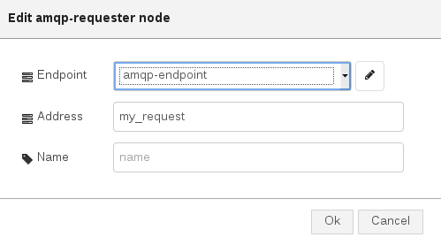

# AMQP Requester

This is node is useful in order to create an AMQP requester for connecting to an AMQP container (i.e. broker, AMQP server, AMQP router, ...), sending a request on the specified address and waiting for the response on a dynamically created address (specified in the request "reply-to" property).

## Configuration

The configuration allows to specify following parameters :

* **_Endpoint_** : the AMQP endpoint configuration node which specifies the AMQP container to connect with this requester;
* **_Address_** : the AMQP address as target for this requester node;
* **_Name_** : name used to identify the node inside the Node-RED flow;

## Input/Output

This node provides following input and output :

* **_input_** : a "Node-RED" message with _msg.payload = <AMQP message>_ with a JSON format containing body and optional header, properties, application_properties and so on. This is the request to send;
* **_output_1_** : a "Node-RED" message with _msg.delivery = <AMQP delivery>_ with a JSON format containing information about delivery on sent message (i.e. "tag"). The other field is _msg.deliveryStatus = <AMQP delivery status>_ with accepted, rejected, released and modified as possible values;
* **_output_2_** : a "Node-RED" message with _msg.payload = <AMQP message>_ with a JSON format containing body and optional header, properties, application_properties and so on. This is the response message. The other field is _msg.delivery = <AMQP delivery>_ with a JSON format containing information about delivery on received message (i.e. "tag");
