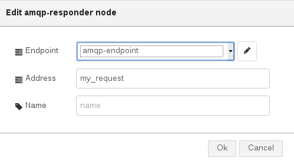

# AMQP Responder

This is node is useful in order to create an AMQP responder for connecting to an AMQP container (i.e. broker, AMQP server, AMQP router, ...), receiving a request on the specified address and then replying on the "reply-to" address specified in the request.

## Configuration

The configuration allows to specify following parameters :

* **_Endpoint_** : the AMQP endpoint configuration node which specifies the AMQP container to connect with this responder;
* **_Address_** : the AMQP address as source for this responder node;
* **_Name_** : name used to identify the node inside the Node-RED flow;

## Input/Output

This node provides following input and output :

* **_input_** : a "Node-RED" message with _msg.payload = <AMQP message>_ with a JSON format containing body and optional header, properties, application_properties and so on. This is the response to send;
* **_output_** : a "Node-RED" message with _msg.payload = <AMQP message>_ with a JSON format containing body and optional header, properties, application_properties and so on. This is the received request to reply;
