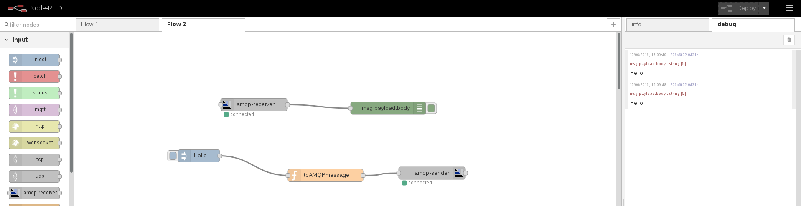
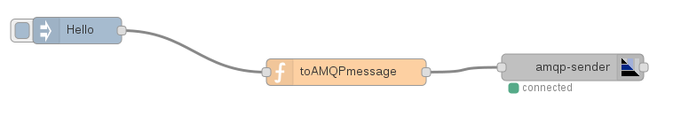
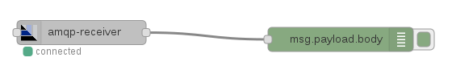

# Getting Started

Consider a simple flow with a simple AMQP sender node which sends a message to a queue on a running broker and an AMQP receiver node which reads from the queue.

# Sender flow

The sender flow is composed of three following nodes :

* _inject_ : it's used in order to inject the message to set inside the AMQP message body and send to the queue on the broker. The msg.payload field is set to "Hello";
* _function_ : it's a function node (named "toAMQPmessage") which get the message from the previous _inject_ node and copis its payload in the "body" field expected as AMQP message by the AMQP sender node in order to send it correctly;
* _amqp-sender_ : an AMQP sender node which is configured to connect to a broker running on the local machine. It receives the message from the previous _function_ node and sends it to the configured queue;

# Receiver flow

The receiver flow is composed of two following nodes :

* _amqp-receiver_ : an AMQP sender node which is configured to connect to a broker running on the local machine. It reads message from a queue and provides it as output;
* _debug_ : this debug node is used in order to show the "body" of the received AMQP message to the debug window;

